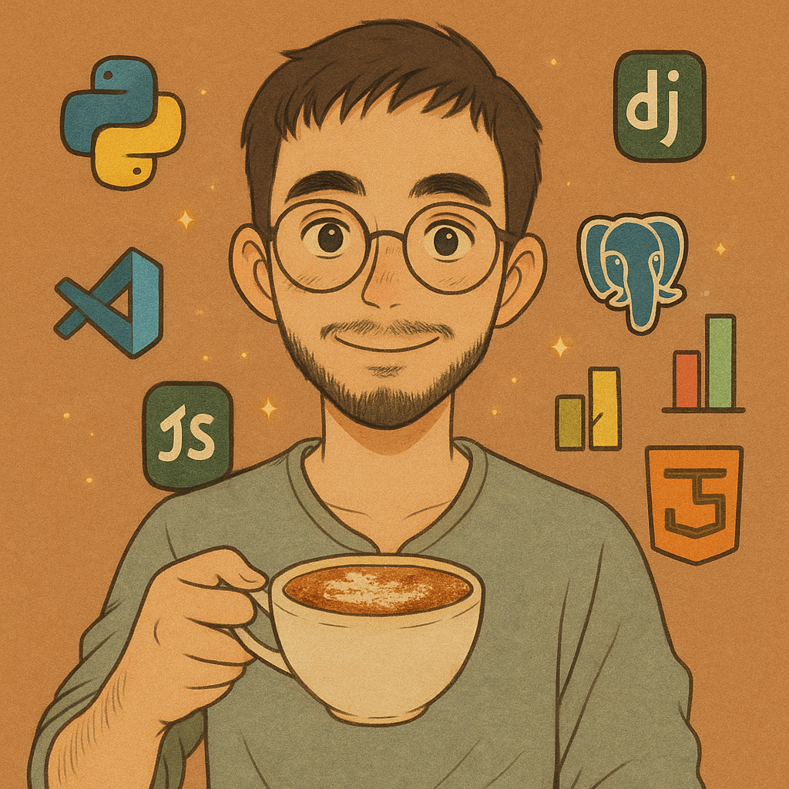

  

# ⚙️ Desenvolvedor Backend  
**Sistemas de Informação - CESMAC (2024-2027)**   

---

## 🔧 Stack Tecnológico

- **Linguagens / Frameworks:** Python, Django, NumPy, Pandas, C, JavaScript, HTML, CSS, 
- **IA e Machine Learning:** OpenAI API, Ollama
- **Ferramentas:** Git, GitHub, PostgreSQL, REST APIs, Streamlit, Docker
- **Metodologias:** SOLID, Testes unitários, DevOps

---

## 📂 Projetos em Destaque

- 📽️ **Analisador de Vídeos com IA** com Python + Whisper + OpenAI API   
- 📊 **Dashboard analítico interativo** com Python + Django + pandas + Numpy + ChartJS + HTML + CSS

---

### 🤝 Estou aberto a desafios inovadores, projetos colaborativos e oportunidades de estágio ou aprendizado.  

